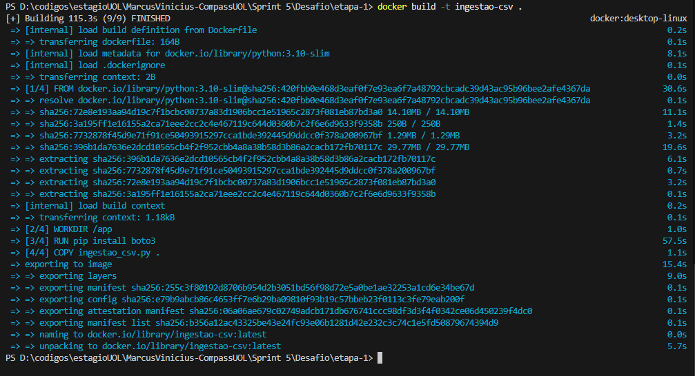
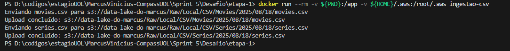
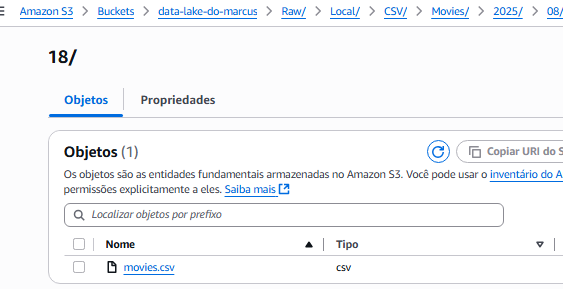
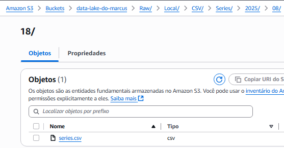
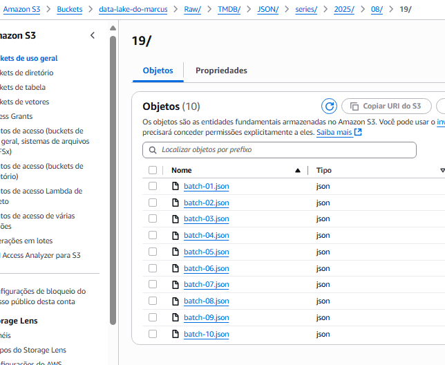
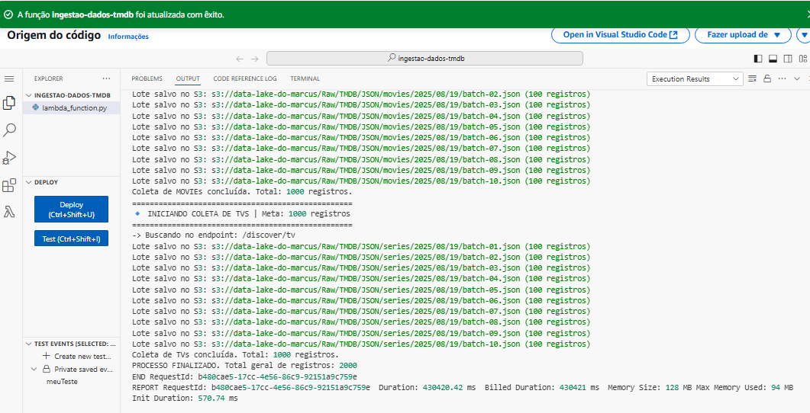
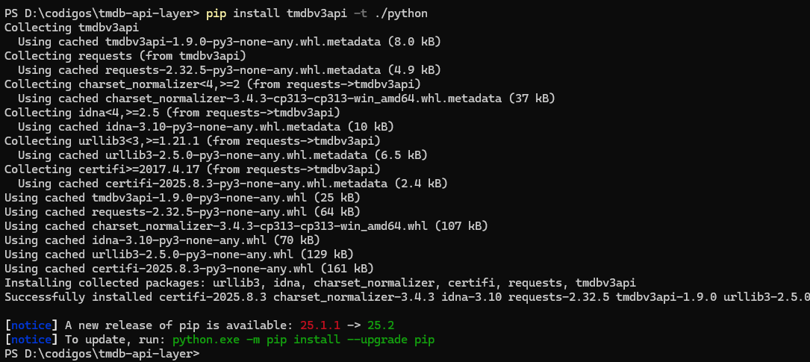
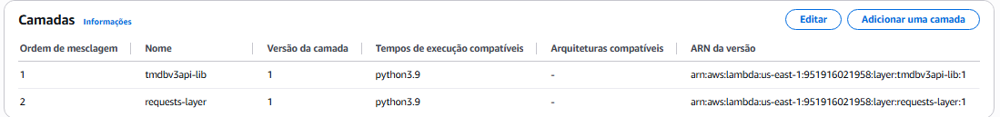

# Sumário
- [Resumo do que aprendi na Sprint](#resumo-do-que-aprendi-na-sprint)
- [Evidências](#evidências)
- [Desafio](#desafio)

# Resumo do que aprendi na Sprint
- Curso 1 - Fundamentos Analytics P1

Nesse curso, aprendi sobre os conceitos básicos de análise de dados, incluindo estatísticas descritivas, visualização de dados e introdução ao Python para análise de dados.

- Curso 2 - Introdução Athena

Nesse curso, aprendi sobre o Amazon Athena, um serviço de consulta interativa que facilita a análise de dados no Amazon S3 usando SQL. Explorei como configurar o Athena, criar tabelas e executar consultas em dados armazenados no S3.

- Curso 3 - Serverless Analytics

Nesse curso, aprendi sobre as arquiteturas de análise de dados sem servidor (serverless) na AWS. Explorei como usar serviços como AWS Lambda, Amazon S3 e Amazon Athena para construir soluções de análise de dados escaláveis e eficientes, sem a necessidade de gerenciar servidores.

# Evidências do Desafio

Evidência do Docker build:

  

Evidência que os arquivos foram enviados para o bucket S3:

  

  

  

Evidência do arquivo rodando no lambda:
  

Evidências de criação das camadas:
  

  

# Desafio
Nessa pasta estão os arquivos referentes ao desafio da Sprint. 

Link para o readme do desafio: [Desafio Sprint](./Desafio/README.md)

# Certificados
- [Curso 1 - Fundamentos Analytics P1](./Certificados/Curso1FundamentosAnalyticsP1.pdf)
- [Curso 2 - Introdução Athena](./Certificados/Curso2IndroducaoAthena.pdf)
- [Curso 3 - Serverless Analytics](./Certificados/Curso3ServerlessAnalytics.pdf)