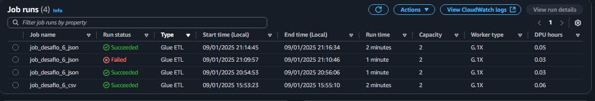
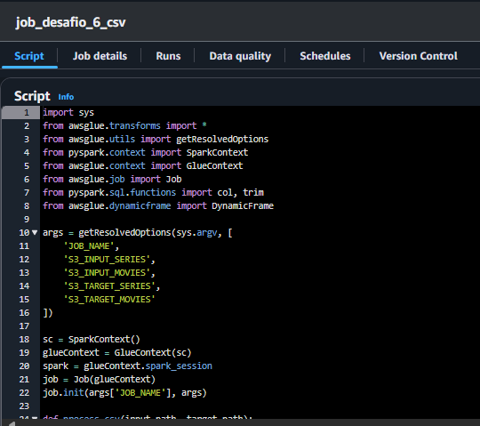
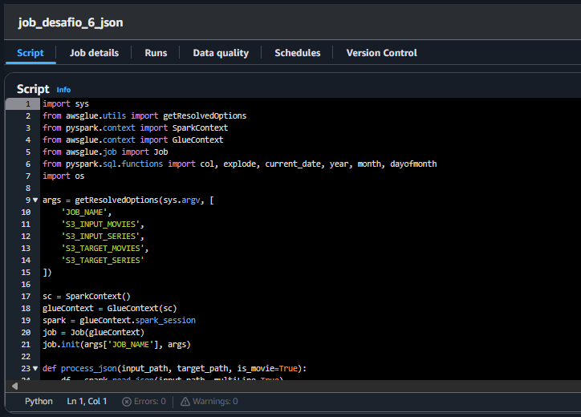
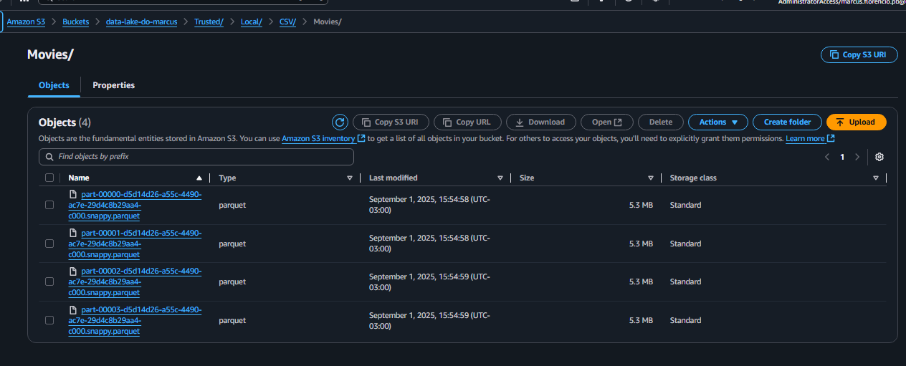
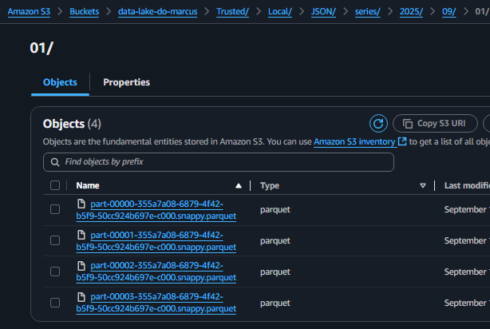
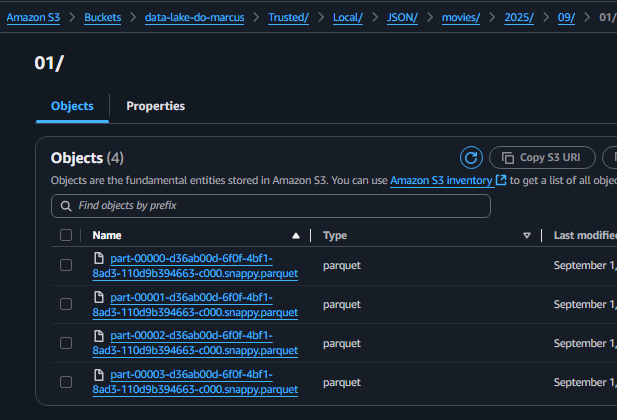

# Sumário
- [Resumo do que aprendi na Sprint](#resumo-do-que-aprendi-na-sprint)
- [Evidências do Desafio](#evidências-do-desafio)
- [Desafio](#desafio)

# Resumo do que aprendi na Sprint

- Curso 1 - AWS Glue

Neste curso, aprendi a usar o AWS Glue, um serviço serverless de integração de dados, para descobrir, preparar e combinar dados para análises, machine learning e desenvolvimento de aplicações. Explorei os benefícios, casos de uso típicos e conceitos técnicos do AWS Glue, incluindo o AWS Glue Studio e o AWS Glue DataBrew. Com o DataBrew, pude aprender a limpar e normalizar dados de forma visual, facilitando a preparação para análises e projetos de machine learning. Também tive a oportunidade de experimentar o serviço na prática por meio de uma demonstração no AWS Management Console.

- Curso 2 - Fundamentals Of Analytics Part 2

Neste curso, que é a segunda parte de uma sequência dedicada às tendências atuais do mercado em analytics, aprofundei meus conhecimentos sobre data lakes, data warehouses e arquiteturas de dados modernas na AWS. Aprendi como planejar e implementar soluções de armazenamento e processamento de dados utilizando os serviços da AWS, compreendendo as ferramentas mais adequadas para criar data warehouses, data lakes e arquiteturas de dados escaláveis e eficientes na nuvem.

- AWS - Tutoriais Técnicos - Analytics

Neste curso aprendi a transformar meus em insights, transformar e catalogar dados com AWS Glue, consultar dados com AWS Athena, e visualizar dados com o Amazon Quicksight

# Evidências do Desafio

Evidência dos jobs executados:

  

script que transforma os csvs em parquet:

  

script que transforma os jsons em parquet:

  

movies.csv em parquet:

  

series.csv em parquet:

  

séries jsons em parquet:

  

filmes jsons em parquet:

  

# Desafio
Nessa pasta estão os arquivos referentes ao desafio da Sprint.

Link para o readme do desafio: [Desafio Sprint](./Desafio/README.md)

# Certificados
- [Curso 1 - AWS Glue](./Certificados/Certificado1_AWSGlue.pdf)
- [Curso 2 - Fundamentals Of Analytics Part 2](./Certificados/Certificado2_FundamentalsOfAnalyticsPart2.pdf)
