# Sumário do Desafio da Sprint
- [Códigos](#códigos)
- [Modelo Dimensional](#modelo-dimensional)
- [Evidências](#evidências)

## 🔵 Sprint 3 – Modelagem Dimensional (Refined Layer)

### Objetivo
Criar modelo dimensional para análise de dados.

Foram desenvolvidas tabelas:

### 🎬 Para Filmes
- DimFilme
- DimGenero
- DimTempo
- FatoFilme

### 📺 Para Séries
- DimSerie
- DimGenero
- DimTempo
- FatoSerie

Filtro aplicado:
- Apenas conteúdos de **Ficção Científica e Fantasia**

Modelos dimensionais:

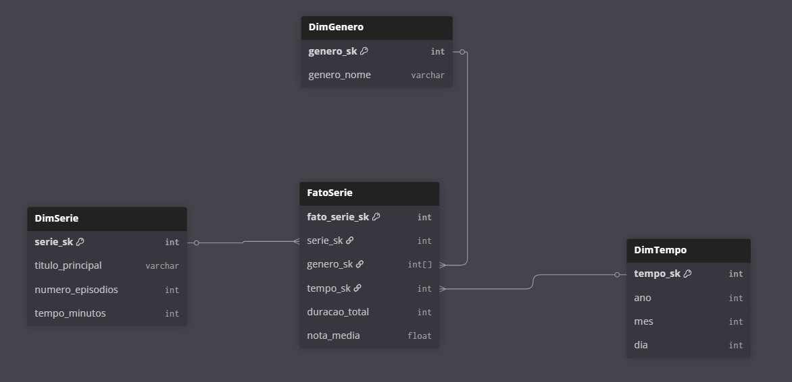

Dados armazenados em:

Refined/ 
├── Movies/ 
│ ├── DimFilme/ 
│ └── FatoFilme/ 
└── Series/ 
├── DimSerie/ 
└── FatoSerie/

✔ Glue Crawler para catalogação  
✔ Escrita em Parquet  
✔ Geração de chaves substitutas  

---

# Perguntas / Análises

Perguntas para Filmes

**1. Quais filmes mais antigos presentes no movies.csv ainda possuem popularidade alta no TMDB?**
Relação: usar anoLancamento e tituloOriginal do CSV para buscar o filme no /search/movie ou /movie/{movie_id} e verificar o campo popularity do TMDB.

**2. Existe relação entre o número de votos (numeroVotos) dos filmes no CSV e a receita de bilheteira (revenue) no TMDB?**
Relação: no CSV temos numeroVotos, no TMDB /movie/{movie_id} retorna revenue. Podemos comparar para ver se filmes muito votados também foram grandes bilheteiras.

Pergunta para Séries

**1. Séries com maior duração total (tempoMinutos * número de episódios no TMDB) são também as mais bem avaliadas (notaMedia)?**
Relação: no CSV temos tempoMinutos e notaMedia. No TMDB /tv/{series_id} temos number_of_episodes. Multiplicando, podemos estimar a duração e relacionar com a média das notas.

# Modelo Dimensional

Resolvi fazer dois modelos dimensionais separados, um para filmes e outro para séries, pois apesar de termos algumas colunas em comum, as tabela fatos são diferentes.

Modelo Dimensional Filmes:

Modelo Dimensional Séries:

# Evidências

Evidência do job no AWS Glue:

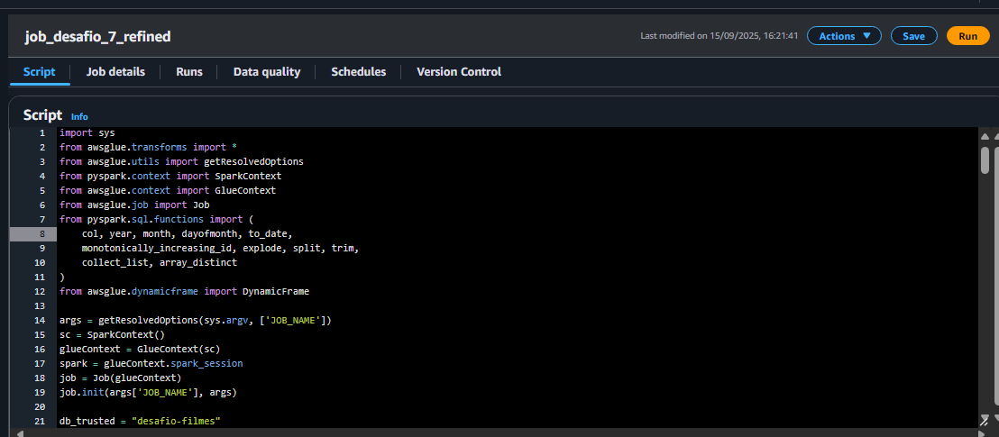
  
Evidência da execução do job:

 

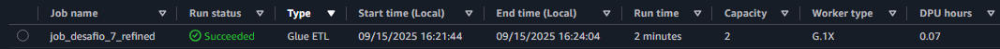
  
Evidência dos dados no S3 em formato Parquet:

 
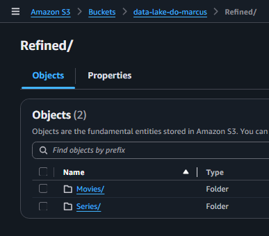
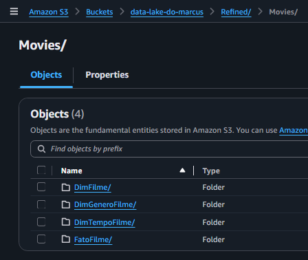
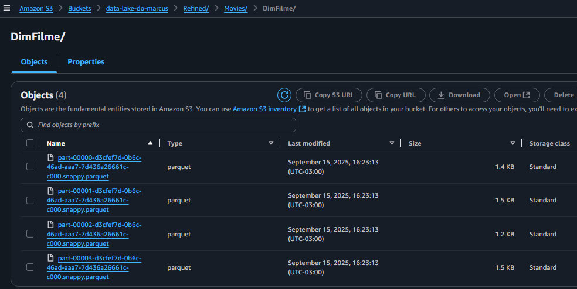
  
Evidência da execução do Crawler:

 

  
Evidência das tabelas geradas:

 
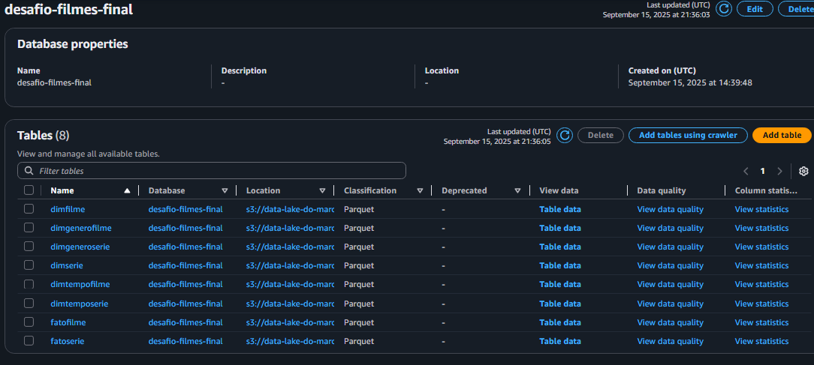
  
Evidência da tabela dimSerie:

 
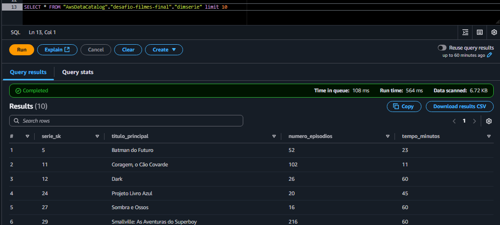
  
Evidência da tabela dimTempoSerie:

 

  
Evidência da tabela dimGeneroSerie:

 
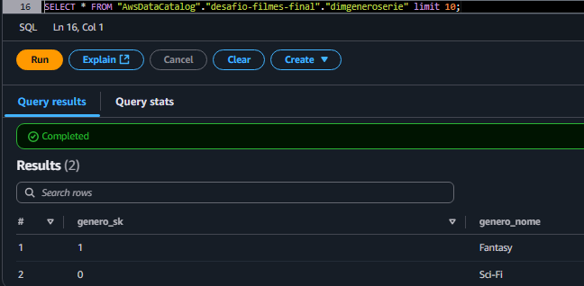
  
Evidência da tabela fatoSerie:

 
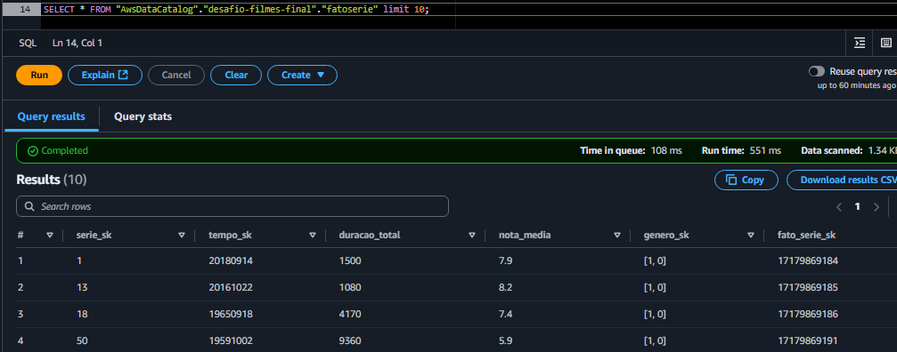
  
Evidência da tabela dimFilme:

 
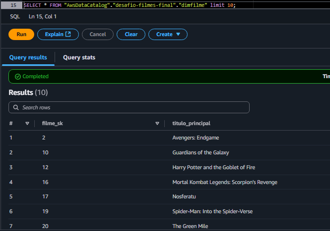
  
Evidência da tabela dimTempoFilme:

 
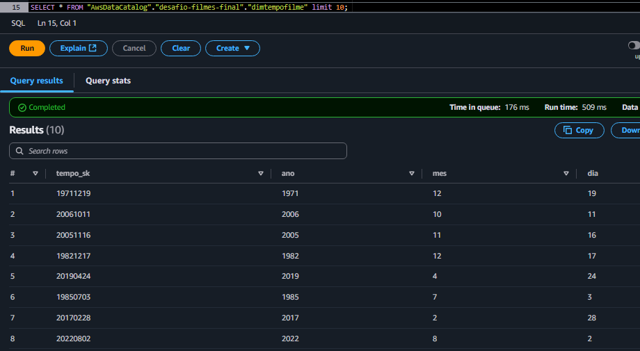
  
Evidência da tabela fatoFilme:

 
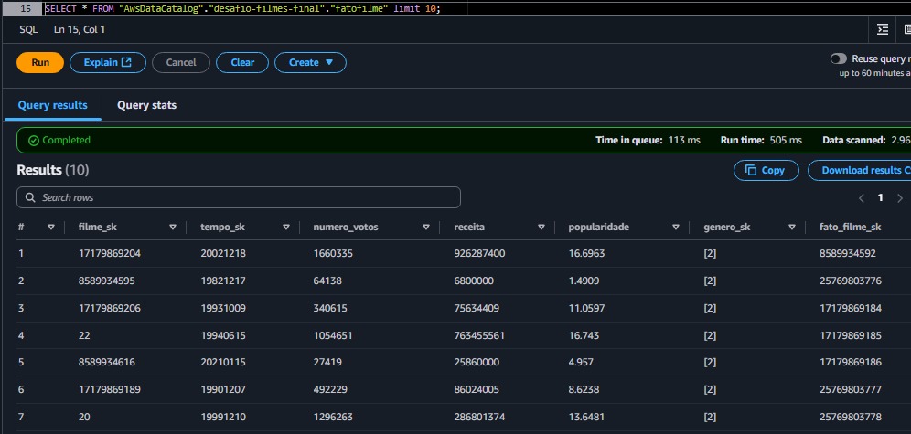
  
Evidência da tabela dimGeneroFilme:

 
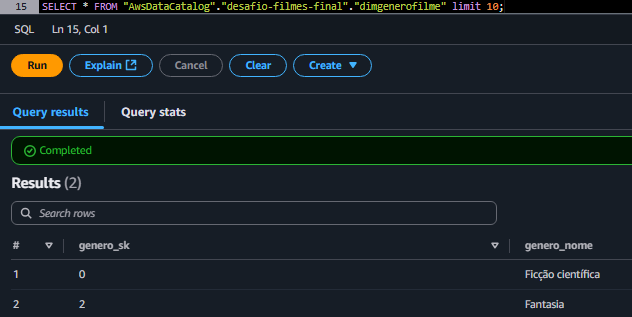

  