# Sumário do Desafio da Sprint

- [Perguntas / Análises](#perguntas--análises)
- [Dashboard](#dashboard)
- [Evidências](#evidências)

# Resumos

Como foi nos instruído no desafio, vou colocar o meu material das sprints passadas aqui de forma resumida.:

## Sprint 1 – Ingestão de Dados (Raw Layer)

### Objetivo
Criar a camada Raw no S3 realizando ingestão de:

- Arquivos CSV (movies.csv e series.csv)
- Dados da API do TMDB

### Implementação

✔ Upload de CSV para S3 via Python + boto3  
✔ Containerização com Docker  
✔ Ingestão via AWS Lambda para API TMDB  
✔ Particionamento por data no S3  

Estrutura de armazenamento:

Raw/ 
├── Local/CSV/Movies/ 
├── Local/CSV/Series/ 
└── TMDB/JSON/{movies|series}/ano/mes/dia/

---

## Sprint 2 – Processamento (Trusted Layer)

### Objetivo
Transformar dados brutos em dados tratados no formato Parquet.

### Implementação

✔ AWS Glue (Spark)  
✔ Limpeza de dados  
✔ Deduplicação  
✔ Cast de tipos  
✔ Tratamento de strings  
✔ Conversão JSON → Parquet  
✔ Conversão CSV → Parquet  

Saída armazenada na camada: 
Trusted/ 
├── Movies/ 
└── Series/

---

## 🔵 Sprint 3 – Modelagem Dimensional (Refined Layer)

### Objetivo
Criar modelo dimensional para análise de dados.

Foram desenvolvidas tabelas:

### 🎬 Para Filmes
- DimFilme
- DimGenero
- DimTempo
- FatoFilme

### 📺 Para Séries
- DimSerie
- DimGenero
- DimTempo
- FatoSerie

Filtro aplicado:
- Apenas conteúdos de **Ficção Científica e Fantasia**

Modelos dimensionais:

Dados armazenados em:

Refined/ 
├── Movies/ 
│ ├── DimFilme/ 
│ └── FatoFilme/ 
└── Series/ 
├── DimSerie/ 
└── FatoSerie/

✔ Glue Crawler para catalogação  
✔ Escrita em Parquet  
✔ Geração de chaves substitutas  

---

## 🟣 Sprint 4 – Dashboard (QuickSight)

# Perguntas / Análises

Perguntas para Filmes

**1. Quais filmes mais antigos presentes no movies.csv ainda possuem popularidade alta no TMDB?**
Relação: usar anoLancamento e tituloOriginal do CSV para buscar o filme no /search/movie ou /movie/{movie_id} e verificar o campo popularity do TMDB.

**2. Existe relação entre o número de votos (numeroVotos) dos filmes no CSV e a receita de bilheteira (revenue) no TMDB?**
Relação: no CSV temos numeroVotos, no TMDB /movie/{movie_id} retorna revenue. Podemos comparar para ver se filmes muito votados também foram grandes bilheteiras.

Pergunta para Séries

**1. Séries com maior duração total (tempoMinutos * número de episódios no TMDB) são também as mais bem avaliadas (notaMedia)?**
Relação: no CSV temos tempoMinutos e notaMedia. No TMDB /tv/{series_id} temos number_of_episodes. Multiplicando, podemos estimar a duração e relacionar com a média das notas.

# Dashboard

Imagem do Dashboard completo feito no QuickSight.

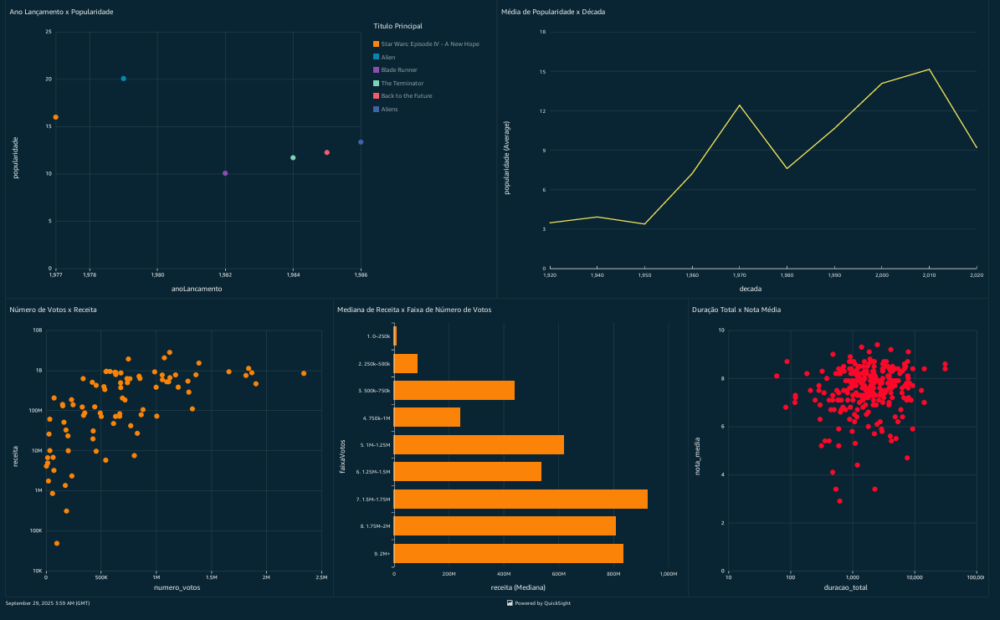
  

Gráfico para a pergunta 1 de filmes:

Fiz um gráfico de dispersão (scatter plot) relacionando o ano de lançamento (anoLancamento) no eixo X e a popularidade (popularity) no eixo Y. Cada ponto representa um filme. Isso permite visualizar se filmes mais antigos ainda mantêm alta popularidade.

Apliquei um filtro para mostrar apenas filmes com popularidade acima de 10 e lançados antes de 1990, destacando os filmes antigos que ainda são populares.

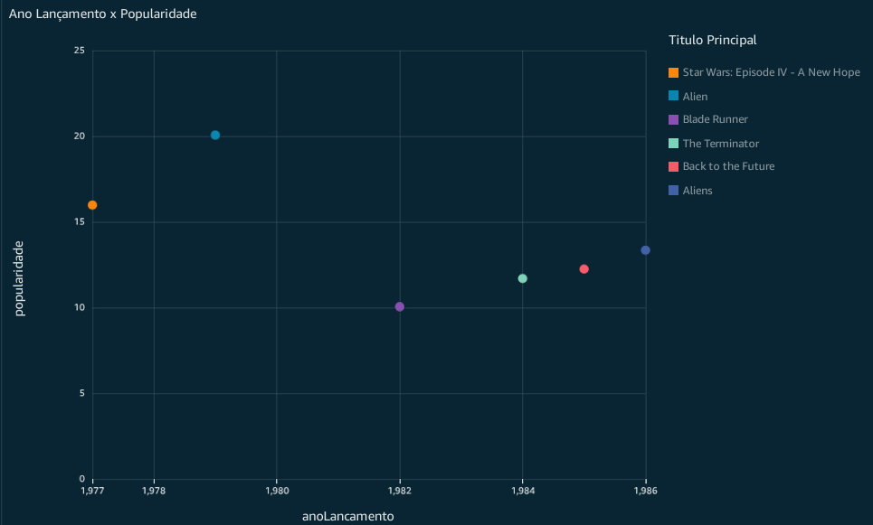
  

Ainda na mesma pergunta, decidi fazer um gráfico de linhas mostrando a tendência da popularidade média dos filmes por década. Pela linha podemos ver que filmes mais novos tendem a ter maior popularidade (considerando uma popularidade próxima de 10).

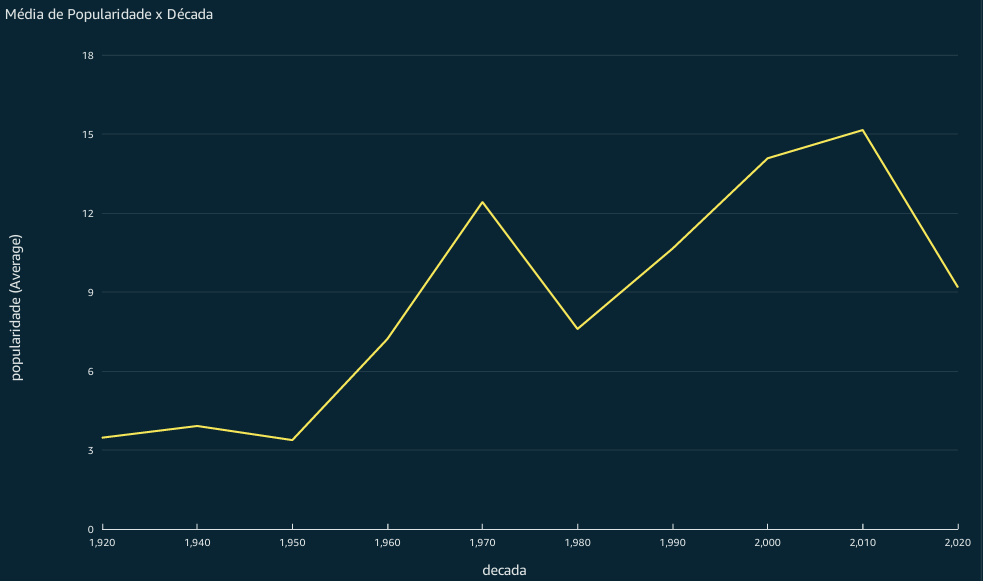
  

Gráfico para a pergunta 2 de filmes:

Fiz um gráfico de dispersão (scatter plot) relacionando o número de votos (numeroVotos) no eixo X e a receita de bilheteira (revenue) no eixo Y. Cada ponto representa um filme. Isso permite visualizar se há correlação entre votos e receita. Apliquei uma escala logarítmica no eixo Y para melhor visualização, já que receitas podem variar muito. Pelo gráfico, parece haver uma tendência de que filmes com mais votos também geram mais receita, mas há exceções.

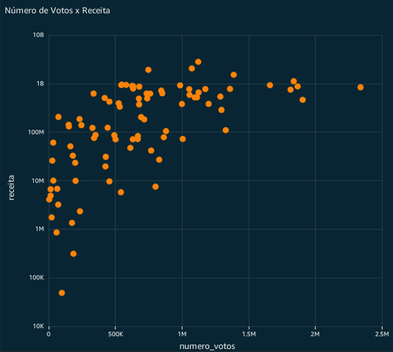
  

Ainda na mesma pergunta, fiz um gráfico de barras horizontais mostrando a mediana da receita (revenue) agrupada por faixas de número de votos (numeroVotos). Isso ajuda a ver se há uma tendência clara de aumento de receita com mais votos. Pelo gráfico, podemos observar que filmes com mais votos tendem a ter maior receita média, sugerindo uma correlação positiva. Peguei a mediana para evitar distorções por filmes com receitas extremamente altas.

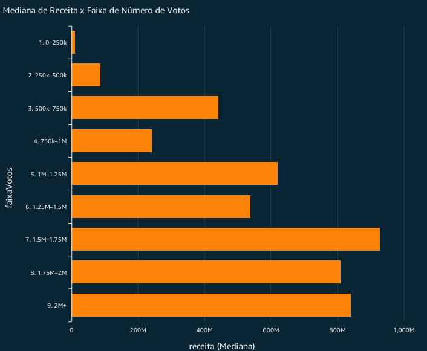
  

Na pergunta 1 de séries:

Fiz um gráfico de dispersão (scatter plot) relacionando a duração total estimada (tempoMinutos * number_of_episodes) no eixo X e a nota média (notaMedia) no eixo Y. Cada ponto representa uma série. Isso permite visualizar se séries mais longas tendem a ter melhores avaliações. Pelo gráfico, não parece haver uma correlação clara entre duração e nota média, sugerindo que séries mais longas não são necessariamente melhores avaliadas.

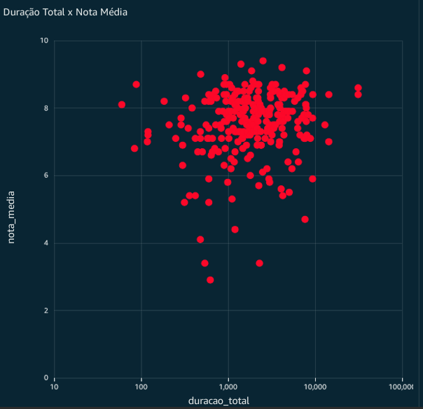
  

## Sobre as cores usadas

Usei as cores da logo da empresa Compass UOL para manter a identidade visual:

  

Mantive o tema escuro (dark mode) no QuickSight para melhor contraste e visualização dos gráficos e para trazer um visual mais moderno.

# Evidências

Evidência das tabelas dos filmes no quicksight

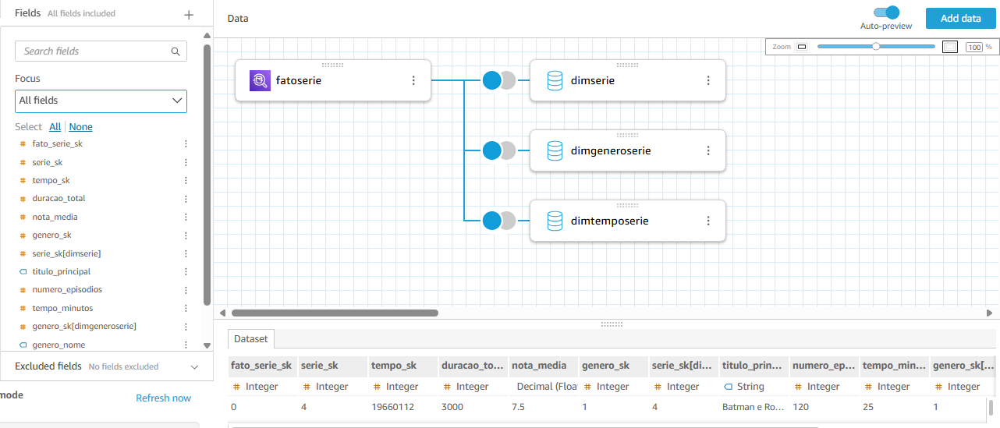
  

Evidência das tabelas das séries no quicksight

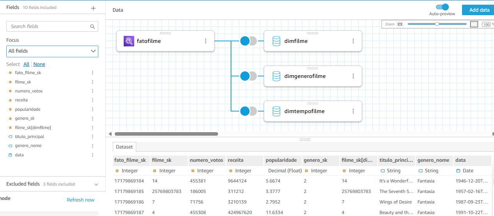
  

Atributos usados no quicksight

Na tabela de séries:

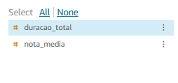
  

Na tabela de filmes:

  

Campos calculados usados no quicksight para filmes:

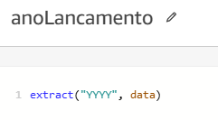
  

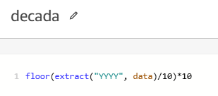
  

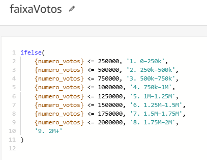
  

